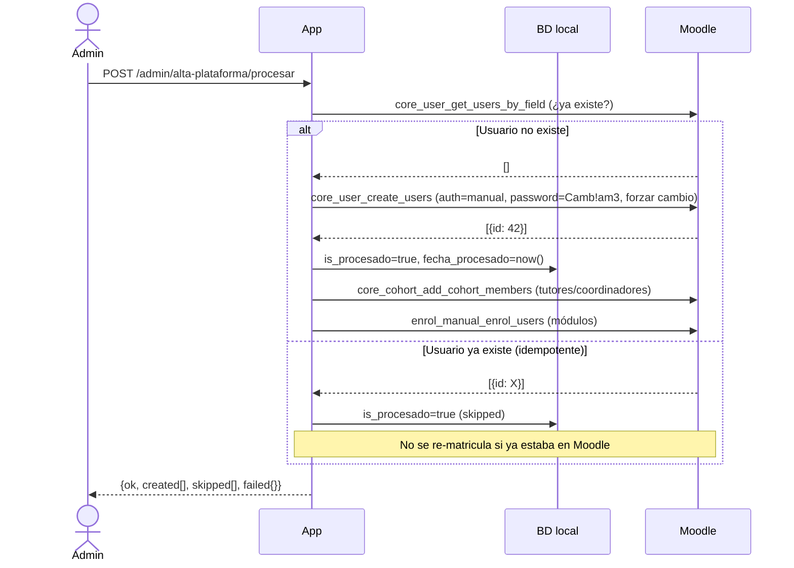
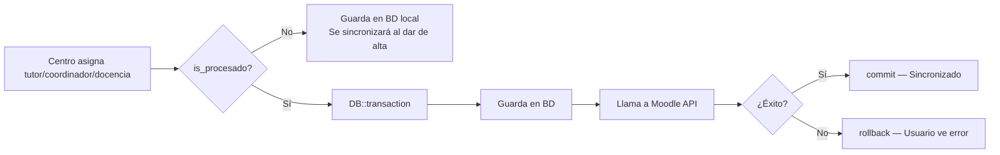
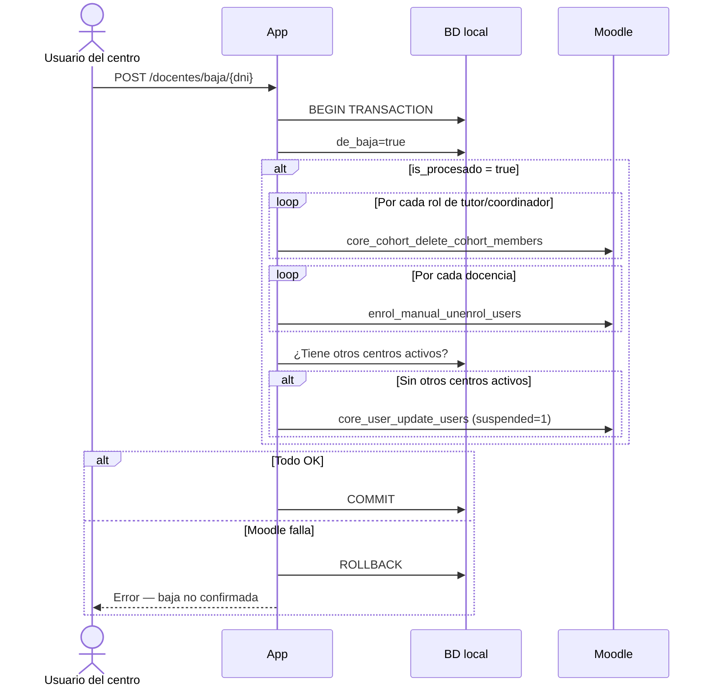
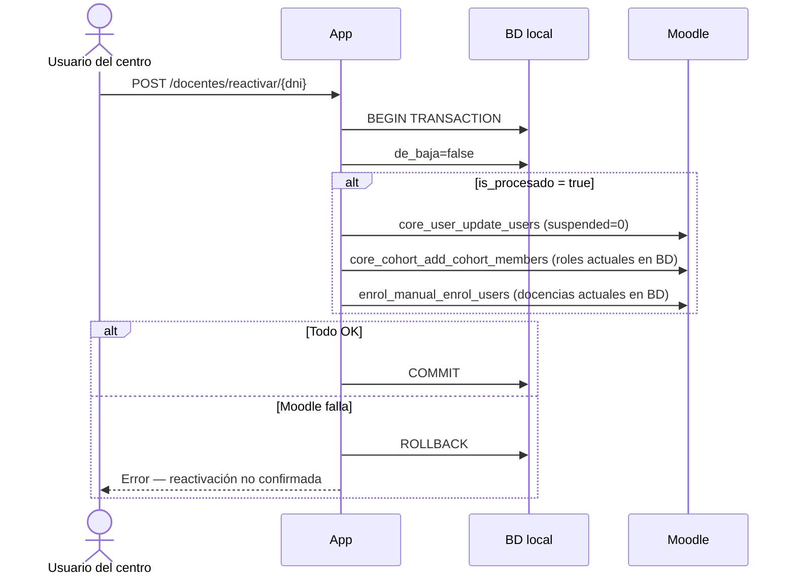

# Integración con Moodle

Esta aplicación gestiona el ciclo de vida completo de los docentes en Moodle mediante la **REST API (Web Services)**, sustituyendo la subida manual de CSVs.

## Índice

1. [Configuración](#configuración)
2. [Conceptos clave de Moodle](#conceptos-clave-de-moodle)
3. [Flujo de datos](#flujo-de-datos)
4. [Convenciones de nomenclatura](#convenciones-de-nomenclatura)
5. [Funciones de la API utilizadas](#funciones-de-la-api-utilizadas)
6. [Operaciones implementadas](#operaciones-implementadas)
7. [Requisitos previos en Moodle](#requisitos-previos-en-moodle)
8. [Logs y diagnóstico](#logs-y-diagnóstico)
9. [Pendiente / Limitaciones conocidas](#pendiente--limitaciones-conocidas)

## Configuración

Variables de entorno necesarias en `.env`:

```env
MOODLE_URL=https://moodle.fpvirtualaragon.es
MOODLE_TOKEN=<wstoken del servicio web>
MOODLE_USER_AUTH=manual
MOODLE_DEFAULT_PASSWORD=Camb!am3
MOODLE_USER_LANG=es
MOODLE_TIMEOUT=15
MOODLE_TEACHER_ROLE_ID=3
```

| Variable | Descripción | Valor por defecto |
|----------|-------------|-------------------|
| `MOODLE_URL` | URL base de la instancia Moodle | — (requerido) |
| `MOODLE_TOKEN` | Token del Web Service (`wstoken`) | — (requerido) |
| `MOODLE_USER_AUTH` | Plugin de autenticación para usuarios nuevos | `manual` |
| `MOODLE_DEFAULT_PASSWORD` | Contraseña inicial (mín. 1 mayúscula, 1 dígito, 1 carácter especial). El usuario debe cambiarla en el primer login | `Camb!am3` |
| `MOODLE_USER_LANG` | Idioma de la interfaz del usuario en Moodle | `es` |
| `MOODLE_TIMEOUT` | Timeout HTTP en segundos | `15` |
| `MOODLE_TEACHER_ROLE_ID` | ID del rol "editingteacher" en la instancia Moodle | `3` |

> **Seguridad**: el `wstoken` nunca se registra en los logs. Verificar que el servicio web de Moodle tenga habilitadas todas las funciones necesarias (ver sección [Funciones de la API](#funciones-de-la-api-utilizadas)).

## Conceptos clave de Moodle

### Usuarios
Cada docente tiene un usuario en Moodle. El username sigue la convención `prof` + DNI en minúsculas (ej: `prof12345678a`). Se crea con autenticación `manual` y contraseña `Camb!am3` con forzado de cambio en el primer login.

El campo `docentes.is_procesado` en la BD local indica si el docente ya tiene cuenta en Moodle.

### Cohortes
Son **grupos globales** de usuarios a nivel de sitio. No pertenecen a ningún curso en concreto. Se usan para agrupar docentes por su rol en un ciclo:

- `tutores_ciclo_{id_ciclo}` — tutores del ciclo
- `coordinadores_ciclo_{id_ciclo}` — coordinadores del ciclo

Las cohortes deben existir previamente en Moodle con el **idnumber** correcto (ver [Requisitos previos](#requisitos-previos-en-moodle)). Normalmente se asocian a cursos mediante la inscripción sincronizada de Moodle, de modo que al añadir un docente a la cohorte queda automáticamente matriculado en los cursos correspondientes.

### Cursos
Cada módulo formativo tiene un curso en Moodle. Los docentes que imparten ese módulo se matriculan directamente en el curso con rol `editingteacher` (rol 3). Los cursos se identifican por su **shortname**: `modulo_{id_modulo}`.

## Flujo de datos

### Alta de un docente



### Asignación de roles en tiempo real

Solo se ejecuta si `docentes.is_procesado = true`. La operación es atómica: si Moodle falla, el cambio en BD se revierte.



### Baja de un docente

Operación atómica: si cualquier llamada a Moodle falla, se hace rollback y la baja no se confirma.



### Reactivación

Operación atómica: si Moodle falla, se hace rollback y el docente sigue marcado como de baja.



## Convenciones de nomenclatura

| Entidad BD local | Identificador en Moodle | Tipo |
|-----------------|------------------------|------|
| `Docente.dni` | Username: `prof` + `strtolower(dni)` | Usuario |
| `Tutor.id_ciclo` | Cohorte idnumber: `tutores_ciclo_{id_ciclo}` | Cohorte |
| `Coordinador.id_ciclo` | Cohorte idnumber: `coordinadores_ciclo_{id_ciclo}` | Cohorte |
| `Docencia.id_modulo` | Course shortname: `modulo_{id_modulo}` | Curso |

## Funciones de la API utilizadas

El Web Service configurado en Moodle debe tener habilitadas las siguientes funciones:

| Función Moodle | Uso |
|----------------|-----|
| `core_user_create_users` | Crear usuario al dar de alta |
| `core_user_get_users_by_field` | Comprobar si el usuario ya existe (idempotencia) y obtener su ID |
| `core_user_update_users` | Suspender (`suspended=1`) o reactivar (`suspended=0`) |
| `core_cohort_add_cohort_members` | Añadir a cohorte de tutor o coordinador |
| `core_cohort_search_cohorts` | Buscar cohorte por idnumber (necesaria para obtener el ID al eliminar) |
| `core_cohort_delete_cohort_members` | Eliminar de cohorte al quitar rol o dar de baja |
| `core_course_get_courses_by_field` | Buscar curso por shortname para obtener su ID |
| `enrol_manual_enrol_users` | Matricular en curso de módulo |
| `enrol_manual_unenrol_users` | Desmatricular de curso de módulo |

## Operaciones implementadas

### Clase principal: `App\Services\MoodleApiService`

| Método público | Descripción |
|----------------|-------------|
| `createUsers(iterable $docentes)` | Crea en lote, devuelve `{created, skipped, failed}` |
| `enrollDocente(Docente $docente)` | Matricula en todas sus cohortes y cursos según la BD |
| `unenrolDocente(Docente $docente, ?string $idCentro)` | Desmatricula; si `$idCentro`, solo los roles de ese centro |
| `addToCohort(string $username, string $cohortIdnumber)` | Añade a una cohorte por idnumber |
| `removeFromCohort(string $username, string $cohortIdnumber)` | Elimina de una cohorte |
| `enrolInCourse(string $username, string $courseShortname)` | Matricula en un curso |
| `unenrolFromCourse(string $username, string $courseShortname)` | Desmatricula de un curso |
| `suspendUser(string $username)` | Suspende el usuario |
| `unsuspendUser(string $username)` | Reactiva el usuario |
| `usernameFor(Docente $docente)` | Devuelve `prof` + DNI en minúsculas |

### Controladores que usan la API

| Controlador | Cuándo llama a Moodle |
|-------------|-----------------------|
| `Admin/AltaPlataformaController` | Al procesar el alta (`procesarAltas`) |
| `BajaDocenteController` | Al dar de baja (`destroy`) y al reactivar (`reactivar`) |
| `EstablecerTutorController` | Al asignar (`store`) y quitar (`destroy`) un tutor |
| `EstablecerCoordinadorController` | Al asignar (`store`) y quitar (`destroy`) un coordinador |
| `EstablecerDocenciaController` | Al asignar (`store`) y quitar (`destroy`) una docencia |

### Gestión de errores

Todas las operaciones que modifican datos son **atómicas**: si Moodle falla, la operación en BD se revierte con rollback y el usuario ve un mensaje de error. Esto garantiza que la app y Moodle nunca queden desincronizados. Si Moodle no está disponible, ninguna operación que le afecte puede completarse.

La única excepción es la matrícula en cohortes/cursos que ocurre **después de crear** un usuario en Moodle (`procesarAltas`): si la creación del usuario tiene éxito pero la matrícula posterior falla, el usuario ya existe en Moodle pero sin sus roles. Este caso se loguea en `moodle_api.log` para revisión; el admin puede volver a procesar el alta (el usuario ya existente se marcará como `skipped` y se re-intentará la matrícula).

**Alta de usuarios** (`createUsers`): si Moodle falla al crear un usuario concreto, ese docente no se marca `is_procesado` y aparece en el campo `failed` de la respuesta JSON. El admin puede reintentar el alta.

## Requisitos previos en Moodle

Antes de poder usar la integración completa, deben existir en Moodle:

### 1. Cohortes del sistema

Crear una cohorte por cada ciclo formativo activo, con el **idnumber** exacto:

```
tutores_ciclo_IFC201
tutores_ciclo_IFC301
tutores_ciclo_IFC302
coordinadores_ciclo_IFC201
coordinadores_ciclo_IFC301
...
```

Si la cohorte no existe al intentar **eliminar** a un miembro, la operación se omite con `WARNING` (no falla). Si no existe al intentar **añadir**, Moodle devuelve un error y la operación hace rollback.

### 2. Cursos de módulos

Cada curso debe tener el **shortname** exacto `modulo_{id_modulo}`, donde `id_modulo` coincide con el valor en la tabla `modulos` de la BD local. Si el curso no existe, la matrícula se omite.

### 3. Servicio web y token

En Moodle: `Administración del sitio → Plugins → Web services → Gestionar tokens`. El token debe pertenecer a un usuario administrador y el servicio debe tener habilitadas las funciones listadas anteriormente.

### 4. Método de inscripción manual

Los cursos de módulo deben tener activo el **método de inscripción manual** para que `enrol_manual_enrol_users` funcione.

## Logs y diagnóstico

Los logs de la integración van a un canal dedicado que nunca mezcla con `laravel.log`:

```
storage/logs/moodle_api.log
```

Niveles utilizados:

| Nivel | Cuándo |
|-------|--------|
| `INFO` | Operación ejecutada correctamente (creación, matrícula, suspensión) |
| `WARNING` | Cohorte o curso no encontrado, usuario no encontrado — operación omitida sin error |
| `ERROR` | Llamada a Moodle fallida — la operación en BD fue revertida (rollback), el usuario vio el error |

Para diagnosticar un alta fallida, revisar también la respuesta JSON de `procesarAltas`:
```json
{
  "ok": false,
  "created": ["12345678A"],
  "skipped": ["87654321B"],
  "failed": { "99999999C": "mensaje de error de Moodle" }
}
```

## Pendiente / Limitaciones conocidas

- **Creación automática de cohortes**: si una cohorte no existe en Moodle, la app la omite en lugar de crearla. Se podría implementar `findOrCreateCohort()` con `core_cohort_create_cohorts`.
- **Reactivación de roles**: al reactivar un docente, se re-matricula en los roles que tenga en la BD en ese momento. Si sus roles fueron eliminados durante la baja, no se recuperan automáticamente.
- **Suspensión multi-centro**: la suspensión solo se ejecuta si el docente no tiene otros centros activos (`de_baja=false`). Si tiene centros activos en otros institutos, solo se desmatricula de los roles del centro que da la baja, pero la cuenta Moodle permanece activa.
- **Moosh**: los controladores todavía tienen comentado el código de `exec(moosh ...)` heredado. Puede eliminarse en una limpieza futura.
