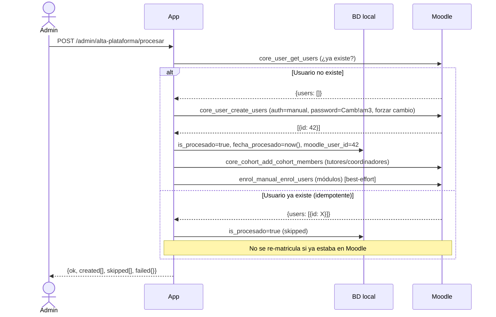
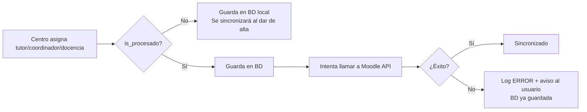
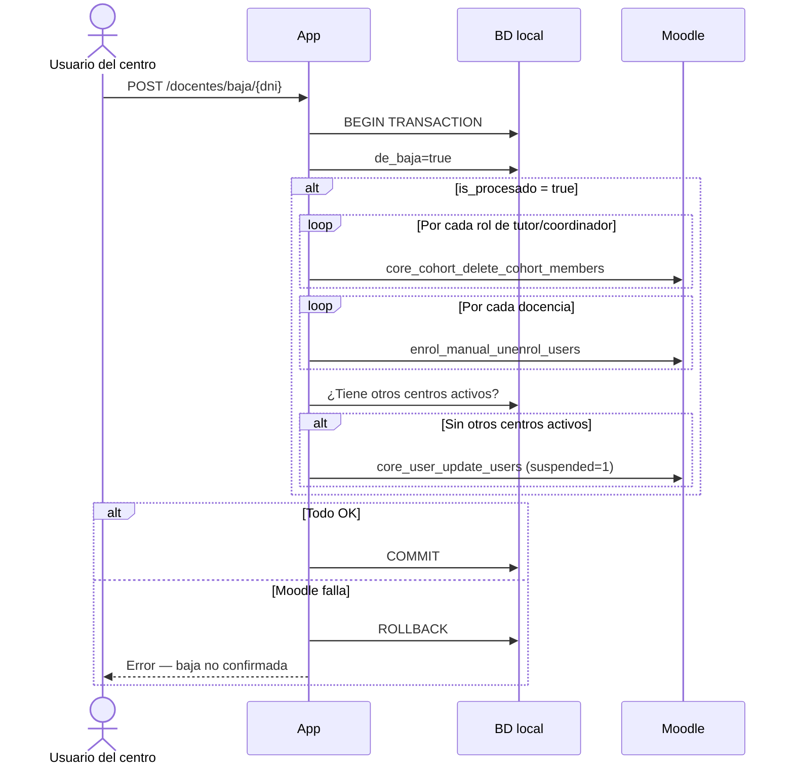
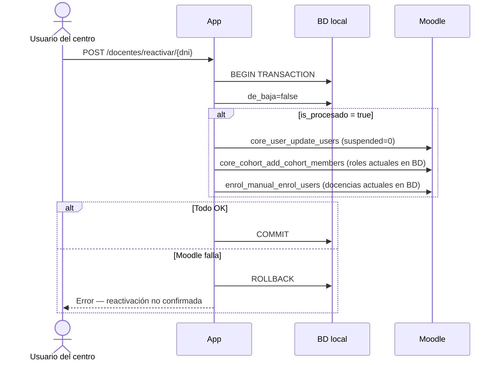

# Integración con Moodle

Esta aplicación gestiona el ciclo de vida completo de los docentes en Moodle mediante la **REST API (Web Services)**, sustituyendo la subida manual de CSVs.

## Índice

1. [Configuración](#configuración)
2. [Conceptos clave de Moodle](#conceptos-clave-de-moodle)
3. [Flujo de datos](#flujo-de-datos)
4. [Convenciones de nomenclatura](#convenciones-de-nomenclatura)
5. [Funciones de la API utilizadas](#funciones-de-la-api-utilizadas)
6. [Operaciones implementadas](#operaciones-implementadas)
7. [Requisitos previos en Moodle](#requisitos-previos-en-moodle)
8. [Logs y diagnóstico](#logs-y-diagnóstico)
9. [Problemas conocidos y pendiente](#problemas-conocidos-y-pendiente)

## Configuración

Variables de entorno necesarias en `.env`:

```env
MOODLE_URL=https://moodle.fpvirtualaragon.es
MOODLE_TOKEN=<wstoken del servicio web>
MOODLE_USER_AUTH=manual
MOODLE_DEFAULT_PASSWORD=Camb!am3
MOODLE_USER_LANG=es
MOODLE_TIMEOUT=15
MOODLE_TEACHER_ROLE_ID=3
```

| Variable | Descripción | Valor por defecto |
|----------|-------------|-------------------|
| `MOODLE_URL` | URL base de la instancia Moodle | — (requerido) |
| `MOODLE_TOKEN` | Token del Web Service (`wstoken`) | — (requerido) |
| `MOODLE_USER_AUTH` | Plugin de autenticación para usuarios nuevos | `manual` |
| `MOODLE_DEFAULT_PASSWORD` | Contraseña inicial (mín. 1 mayúscula, 1 dígito, 1 carácter especial). El usuario debe cambiarla en el primer login | `Camb!am3` |
| `MOODLE_USER_LANG` | Idioma de la interfaz del usuario en Moodle | `es` |
| `MOODLE_TIMEOUT` | Timeout HTTP en segundos | `15` |
| `MOODLE_TEACHER_ROLE_ID` | ID del rol "editingteacher" en la instancia Moodle | `3` |

> **Seguridad**: el `wstoken` nunca se registra en los logs. Verificar que el servicio web de Moodle tenga habilitadas todas las funciones necesarias (ver sección [Funciones de la API](#funciones-de-la-api-utilizadas)).

## Conceptos clave de Moodle

### Usuarios
Cada docente tiene un usuario en Moodle. El username sigue la convención `prof` + DNI en minúsculas (ej: `prof12345678a`). Se crea con autenticación `manual` y contraseña `Camb!am3` con forzado de cambio en el primer login.

El campo `docentes.is_procesado` en la BD local indica si el docente ya tiene cuenta en Moodle. El campo `docentes.moodle_user_id` almacena el ID numérico de Moodle (devuelto por `core_user_create_users`) para evitar búsquedas por username en operaciones inmediatamente posteriores a la creación (los cursos pueden tardar en indexar el usuario nuevo).

### Cohortes
Son **grupos globales** de usuarios a nivel de sitio. No pertenecen a ningún curso en concreto. Se usan para agrupar docentes por su rol en un ciclo:

- `tutores_ciclo_{id_ciclo}` — tutores del ciclo
- `coordinadores_ciclo_{id_ciclo}` — coordinadores del ciclo

Las cohortes deben existir previamente en Moodle con el **idnumber** correcto (ver [Requisitos previos](#requisitos-previos-en-moodle)). Normalmente se asocian a cursos mediante la inscripción sincronizada de Moodle, de modo que al añadir un docente a la cohorte queda automáticamente matriculado en los cursos correspondientes.

### Cursos
Cada módulo formativo tiene un curso en Moodle. El shortname del curso sigue el formato `{codigo_centro}-{id_ciclo}-{id_modulo}` (ej: `22002491-SSC201-5381`), donde `codigo_centro` coincide con el campo `id_centro` de la tabla `centros` de la BD local (que a su vez proviene del código numérico del centro extraído del CSV de centros).

Si el modelo `Centro` tiene el campo `moodle_codigo` relleno, se usa ese valor en lugar de `id_centro`.

## Flujo de datos

### Alta de un docente



### Asignación de roles en tiempo real

Solo se ejecuta si `docentes.is_procesado = true`. La operación en BD siempre tiene éxito. Si Moodle falla, se guarda el cambio y se muestra un aviso amarillo al usuario.



### Baja de un docente

Operación atómica: si cualquier llamada a Moodle falla, se hace rollback y la baja no se confirma.



### Reactivación

Operación atómica: si Moodle falla, se hace rollback y el docente sigue marcado como de baja.



## Convenciones de nomenclatura

| Entidad BD local | Identificador en Moodle | Tipo |
|-----------------|------------------------|------|
| `Docente.dni` | Username: `prof` + `strtolower(dni)` | Usuario |
| `Tutor.id_ciclo` | Cohorte idnumber: `tutores_ciclo_{id_ciclo}` | Cohorte |
| `Coordinador.id_ciclo` | Cohorte idnumber: `coordinadores_ciclo_{id_ciclo}` | Cohorte |
| `DocenteCicloModulo` | Course shortname: `{id_centro}-{id_ciclo}-{id_modulo}` | Curso |

> El `id_centro` en la BD coincide con el código numérico del centro en Moodle (ej: `22002491`), ya que el seeder lo extrae del primer segmento del shortname del CSV de centros.

## Funciones de la API utilizadas

El Web Service configurado en Moodle debe tener habilitadas las siguientes funciones:

| Función Moodle | Uso |
|----------------|-----|
| `core_user_create_users` | Crear usuario al dar de alta |
| `core_user_get_users` | Comprobar si el usuario ya existe (criteria key/value); requiere `moodle/user:viewdetails` |
| `core_user_update_users` | Suspender (`suspended=1`) o reactivar (`suspended=0`) |
| `core_cohort_add_cohort_members` | Añadir a cohorte de tutor o coordinador |
| `core_cohort_search_cohorts` | Buscar cohorte por idnumber (necesaria para obtener el ID al eliminar) |
| `core_cohort_delete_cohort_members` | Eliminar de cohorte al quitar rol o dar de baja |
| `core_course_get_courses_by_field` | Buscar curso por shortname para obtener su ID |
| `enrol_manual_enrol_users` | Matricular en curso de módulo |
| `enrol_manual_unenrol_users` | Desmatricular de curso de módulo |

> **Nota**: se usa `core_user_get_users` (con criteria) en lugar de `core_user_get_users_by_field` porque este último requiere el permiso adicional `moodle/user:viewuseridentity` que no siempre está disponible en tokens no administradores.

## Operaciones implementadas

### Clase principal: `App\Services\MoodleApiService`

| Método público | Descripción |
|----------------|-------------|
| `createUsers(iterable $docentes)` | Crea en lote, devuelve `{created, skipped, failed}` |
| `enrollDocente(Docente $docente, bool $throwOnError)` | Matricula en todas sus cohortes y cursos según la BD |
| `unenrolDocente(Docente $docente, ?string $idCentro, bool $throwOnError)` | Desmatricula; si `$idCentro`, solo los roles de ese centro |
| `addToCohort(string $username, string $cohortIdnumber)` | Añade a una cohorte por idnumber |
| `removeFromCohort(string $username, string $cohortIdnumber)` | Elimina de una cohorte |
| `enrolInCourse(string $username, string $courseShortname)` | Matricula en un curso |
| `unenrolFromCourse(string $username, string $courseShortname)` | Desmatricula de un curso |
| `suspendUser(string $username)` | Suspende el usuario |
| `unsuspendUser(string $username)` | Reactiva el usuario |
| `usernameFor(Docente $docente)` | Devuelve `prof` + DNI en minúsculas |

### Controladores que usan la API

| Controlador | Operación | Comportamiento ante fallo de Moodle |
|-------------|-----------|--------------------------------------|
| `Admin/AltaPlataformaController` | Alta masiva | BD siempre guardada; errores por docente en respuesta JSON |
| `BajaDocenteController::destroy` | Baja | **Atómico**: rollback si Moodle falla |
| `BajaDocenteController::reactivar` | Reactivación | **Atómico**: rollback si Moodle falla |
| `EstablecerTutorController` | Asignar/quitar tutor | BD siempre guardada; aviso amarillo si Moodle falla |
| `EstablecerCoordinadorController` | Asignar/quitar coordinador | BD siempre guardada; aviso amarillo si Moodle falla |
| `EstablecerDocenciaController` | Asignar/quitar docencia | BD siempre guardada; aviso amarillo si Moodle falla |

### Gestión de errores

- **Baja y reactivación**: operaciones atómicas. Si Moodle falla, la operación en BD se revierte con rollback. Nunca quedan desincronizados.
- **Asignación de roles** (tutor/coordinador/docencia): la BD siempre se guarda. Si Moodle no puede sincronizar, el usuario ve un aviso amarillo y el error queda en `moodle_api.log`. La sincronización puede completarse manualmente o al volver a intentar la operación.
- **Alta masiva**: si la creación del usuario tiene éxito pero la matrícula posterior falla, el usuario existe en Moodle pero sin sus roles. Se loguea el error; el admin puede reasignar los roles desde los formularios del centro.

## Requisitos previos en Moodle

### 1. Cohortes del sistema

Crear una cohorte por cada ciclo formativo activo, con el **idnumber** exacto:

```
tutores_ciclo_IFC201
tutores_ciclo_IFC301
tutores_ciclo_IFC302
coordinadores_ciclo_IFC201
coordinadores_ciclo_IFC301
...
```

Si la cohorte no existe al intentar **eliminar** a un miembro, la operación se omite con `WARNING` (no falla). Si no existe al intentar **añadir**, Moodle devuelve un error que se loguea como `ERROR` (la BD ya está guardada).

### 2. Cursos de módulos

Cada curso debe tener el **shortname** exacto `{id_centro}-{id_ciclo}-{id_modulo}` (ej: `22002491-SSC201-5381`). Si el curso no existe, la matrícula se omite con `WARNING`.

### 3. Método de inscripción manual en los cursos

Los cursos de módulo deben tener activo el **método de inscripción manual** para que `enrol_manual_enrol_users` funcione. Sin él, Moodle devuelve "Curso o actividad no accesible." y la matrícula falla.

Para habilitarlo: en cada curso de Moodle → Participantes → Métodos de matriculación → añadir "Matriculaciones manuales". También puede hacerse de forma masiva desde Administración del sitio.

### 4. Servicio web y token

En Moodle: `Administración del sitio → Plugins → Web services → Gestionar tokens`. El token debe pertenecer a un usuario administrador y el servicio debe tener habilitadas las funciones listadas anteriormente.

## Logs y diagnóstico

Los logs de la integración van a un canal dedicado que nunca mezcla con `laravel.log`:

```
storage/logs/moodle_api.log
```

Niveles utilizados:

| Nivel | Cuándo |
|-------|--------|
| `INFO` | Operación ejecutada correctamente (creación, matrícula, suspensión) |
| `WARNING` | Cohorte o curso no encontrado, usuario no encontrado — operación omitida sin error |
| `ERROR` | Llamada a Moodle fallida — en baja/reactivar se hizo rollback; en roles se guardó BD y se avisó al usuario |

Para diagnosticar un alta fallida, revisar también la respuesta JSON de `procesarAltas`:
```json
{
  "ok": false,
  "created": ["12345678A"],
  "skipped": ["87654321B"],
  "failed": { "99999999C": "mensaje de error de Moodle" }
}
```

## Problemas conocidos y pendiente

### Matrícula en cursos de módulo no funciona en producción

**Causa**: los cursos de módulo (`22002491-SSC201-5381`) no tienen habilitado el plugin de **matriculación manual** en Moodle. La llamada a `enrol_manual_enrol_users` devuelve `"Curso o actividad no accesible."`.

**Síntoma en logs**:
```
ERROR: Error en matrícula de curso al asignar docencia {"course":"22002491-SSC201-5381","error":"Curso o actividad no accesible."}
```

**Solución pendiente**: el administrador de Moodle debe habilitar "Matriculaciones manuales" en los cursos afectados, o bien cambiar el enfoque de matrícula a sincronización por cohorte (ver punto siguiente).

---

### Alternativa: usar cohortes por módulo en lugar de matrícula directa

Si los cursos de módulo tienen una cohorte sincronizada (con el mismo idnumber que el shortname del curso), la matrícula podría hacerse vía `addToCohort` en lugar de `enrolInCourse`. Esto no requiere que el curso tenga matrícula manual activa.

Requiere crear y configurar cohorts en Moodle para cada módulo, lo cual no está implementado actualmente.

---

### Usuarios sin `moodle_user_id` almacenado

Los docentes dados de alta **antes** de la migración `2026_06_05_000002` tienen `moodle_user_id = NULL` en la BD. Para estas operaciones:
- `findMoodleUserId` intenta la búsqueda por username vía API
- Si la búsqueda falla (permisos o caché de Moodle), el usuario no se encuentra y la operación se omite con `WARNING`

**Solución inmediata**: rellenar `moodle_user_id` manualmente para los docentes ya existentes, o dar de alta de nuevo (serán `skipped` pero la matrícula sí se reintentará con el ID guardado si está en `docentes.moodle_user_id`).

---

### Cohortes: creación automática no implementada

Si una cohorte (`tutores_ciclo_X`, `coordinadores_ciclo_X`) no existe en Moodle, la app no la crea automáticamente. Se podría implementar `findOrCreateCohort()` con `core_cohort_create_cohorts`.

---

### Suspensión/reactivación de docentes multi-centro

La suspensión solo se ejecuta si el docente no tiene otros centros activos (`de_baja=false`). Si tiene centros activos en otros institutos, solo se desmatricula de los roles del centro que da la baja, pero la cuenta Moodle permanece activa. No se ha verificado si este comportamiento es el correcto para el caso de uso.

---

### Moosh: código comentado heredado

Los controladores `BajaDocenteController` y `AltaDocenteController` todavía contienen código `exec(moosh ...)` comentado de la implementación anterior. Puede eliminarse en una limpieza futura.
